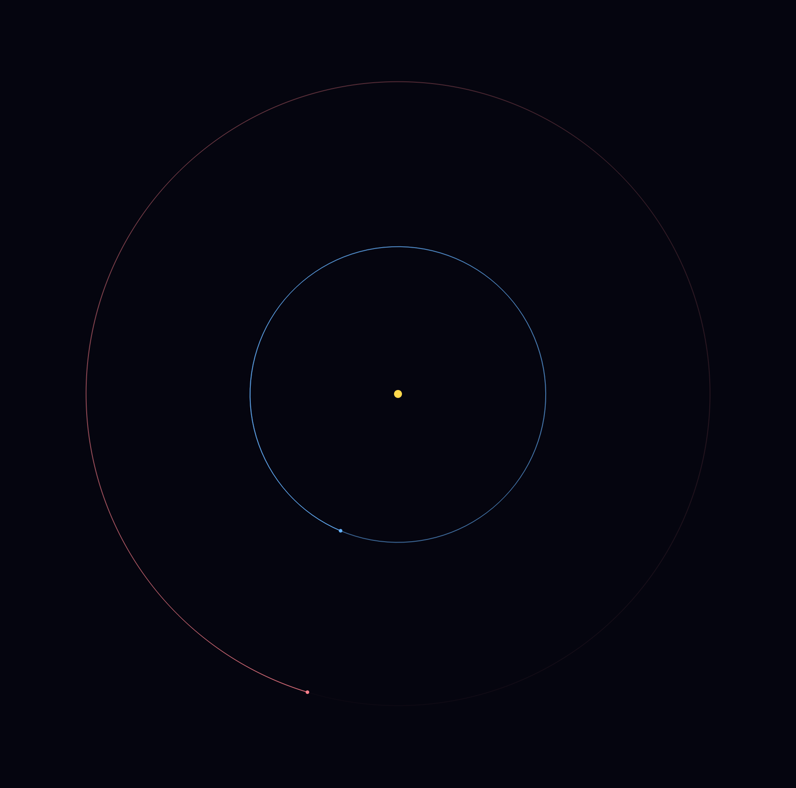
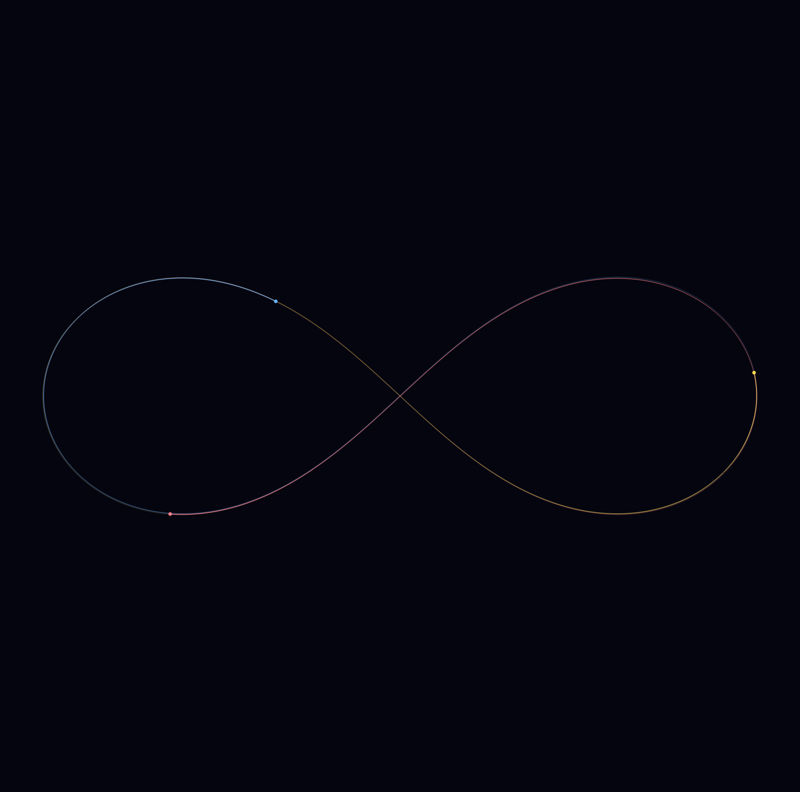

# Gravity Simulation

[](https://github.com/nathanaelhub/gravity-sim/actions/workflows/ci.yml)

A modular C++17 N-body gravity simulator using Newton's law of universal
gravitation, rendered with GLFW + OpenGL. Starts with three bodies — a
"sun" and two planets — in stable circular orbits.



## Presets

| Preset | Command | Description |
|---|---|---|
| `orbit` (default) | `./build/gravity_sim` | Sun + two planets on circular orbits |
| `figure8` | `./build/gravity_sim --preset figure8` | Chenciner–Montgomery figure-8: three equal masses chasing each other along one lemniscate |

The figure-8 choreography is numerically delicate — it only stays on its
track if the integrator is accurate, so it doubles as a correctness demo.
Measured over 5 periods: positions stay bounded and total energy drifts
by ~0.005%.



## Physics

- Pairwise attraction: `F = G * m1 * m2 / r²`, applied symmetrically
  (Newton's third law) so each pair is computed once — O(n²/2) per step.
- **Plummer softening** (`r² → r² + ε²`) bounds the force as particles
  approach, preventing division by zero and unphysical slingshots.
- **Semi-implicit (symplectic) Euler** integration keeps orbital energy
  bounded; explicit Euler would spiral outward.
- Each rendered frame is split into 8 substeps for stability, and the
  frame delta is clamped so window drags don't blow up the integrator.

## Layout

```
gravity-sim/
├── CMakeLists.txt
├── README.md
├── assets/
│   ├── orbits.png       # generated via screenshot mode (see below)
│   └── figure8.png
├── include/
│   ├── Vector2D.hpp     # vector math: add, scale, length, distance, dot
│   ├── Particle.hpp     # mass, position, velocity, accumulated acceleration
│   └── Simulation.hpp   # engine interface
├── src/
│   ├── Simulation.cpp   # pairwise force computation + integration
│   └── main.cpp         # GLFW window, 3-body setup, render loop
├── tests/               # headless physics unit tests (no OpenGL)
└── Makefile             # `make test` — builds and runs the tests
```

## Build & run

Requires CMake ≥ 3.16 and a C++17 compiler. GLFW is found on the system
if installed, otherwise fetched and built automatically.

```sh
cmake -B build
cmake --build build
./build/gravity_sim
```

Press `Esc` to quit.

### Screenshot mode

Run a fixed number of deterministic frames and save the final frame
as a BMP (used to generate the image above):

```sh
./build/gravity_sim --frames 420 --out assets/orbits.bmp
sips -s format png assets/orbits.bmp --out assets/orbits.png   # macOS
```

## Tests

The simulation core (`Vector2D`, `Particle`, `Simulation`) is separate from the
rendering, so it is unit-tested **headless — no OpenGL/GLFW required**. The suite
covers the vector math, semi-implicit Euler integration, pairwise attraction,
**momentum conservation** across a 3-body run, Plummer-softening finiteness, and
that a circular orbit stays bounded (the symplectic-integrator claim above). CI
runs it on every push.

```sh
make test    # 23 checks
```

## Extending

- Add a preset: write a `make...System()` function and wire it into the
  `--preset` flag — `circularSpeed()` gives the velocity for a stable
  circular orbit around a central mass.
- Swap `Vector2D` for a `Vector3D` and a perspective projection for 3D.
- Replace the O(n²) loop with a Barnes–Hut quadtree for large n.

## License

MIT — see [LICENSE](LICENSE).
